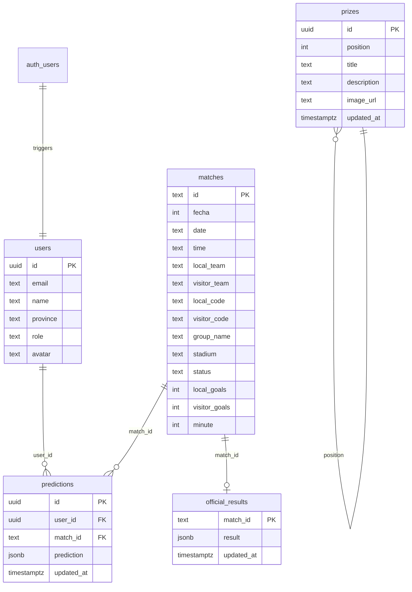

<div align="center">

# ⚽ Prode MagIA

### 🏆 Prode del Mundial FIFA 2026 — por MAG

<br/>

[](https://react.dev/)
[](https://vitejs.dev/)
[](https://supabase.com/)
[](https://www.typescriptlang.org/)
[](https://tailwindcss.com/)
[](https://expressjs.com/)

<br/>

Dashboard interactivo de predicciones de fútbol para el **Mundial FIFA 2026**. Los usuarios registran sus pronósticos, compiten en un ranking general, y siguen el fixture en tiempo real. Incluye sistema de premios y chat grupal en tiempo real entre participantes.

<br/>

</div>

---

## 📋 Tabla de Contenidos

- [✨ Características](#-características)
- [🏗️ Arquitectura](#️-arquitectura)
- [🛠️ Tech Stack](#️-tech-stack)
- [📁 Estructura del Proyecto](#-estructura-del-proyecto)
- [⚙️ Configuración y Setup](#️-configuración-y-setup)
- [🗄️ Base de Datos](#️-base-de-datos)
- [🔐 Roles y Permisos](#-roles-y-permisos)
- [📊 Sistema de Puntuación](#-sistema-de-puntuación)
- [🎁 Sistema de Premios](#-sistema-de-premios)
- [💬 Chat Grupal](#-chat-grupal)
- [🚀 Deploy](#-deploy)
- [👥 Autores](#-autores)

---

## ✨ Características

| Feature | Descripción |
|---|---|
| 🎯 **Pronósticos** | Cargá tus predicciones para cada partido del Mundial. Interfaz intuitiva con selectores de goles. |
| 📊 **Ranking en vivo** | Tabla de posiciones dinámica calculada en tiempo real según resultados oficiales. |
| 🏟️ **Fixture completo** | Bracket visual con fase de grupos, octavos, cuartos, semis y final. |
| 🗺️ **Mapa de Argentina** | Visualización interactiva con distribución geográfica de participantes por provincia. |
| 📈 **Historial y estadísticas** | Gráficos de tendencia de puntos, precisión y rachas. |
| 🎁 **Premios** | Sistema de premios configurables por el admin para los primeros puestos. |
| 💬 **Chat grupal** | Chat en tiempo real entre participantes con Supabase Realtime. |
| 👤 **Perfiles de usuario** | Panel de perfil con estadísticas personales, avatar y provincia. |
| 🔒 **Autenticación** | Login/Registro con Supabase Auth (email + password). |
| ⚙️ **Panel Admin** | Carga de resultados oficiales y configuración del torneo (solo admins). |
| 🌑 **Dark Mode** | Diseño premium con modo oscuro por defecto. |
| 📱 **Mobile-first** | Navegación inferior para mobile, tabs para desktop. Totalmente responsive. |

---

## 🏗️ Arquitectura

```
┌──────────────────────────────────────────────────────┐
│                     FRONTEND                         │
│         React 19 + Vite + TailwindCSS 4              │
│              Puerto: 3000                            │
├──────────────┬───────────────────────────────────────┤
│              │                                       │
│   Supabase   │          API Backend                  │
│   Client JS  │      Express 5 + TypeScript           │
│  (Auth, DB)  │         Puerto: 3005                  │
│              │                                       │
├──────────────┴───────────────────────────────────────┤
│                    SUPABASE                          │
│       Auth  ·  PostgreSQL  ·  RLS  ·  Storage        │
├──────────────────────────────────────────────────────┤
│                 API-FOOTBALL (v3)                    │
│           Datos de partidos en vivo                  │
├──────────────────────────────────────────────────────┤
│               SUPABASE REALTIME                      │
│           Chat grupal en tiempo real                 │
└──────────────────────────────────────────────────────┘
```

---

## 🛠️ Tech Stack

### Frontend (`/Front`)
| Tecnología | Uso |
|---|---|
| **React 19** | UI components con hooks |
| **Vite 6** | Build tool y dev server |
| **TypeScript** | Tipado estático |
| **TailwindCSS 4** | Estilos utility-first |
| **Lucide React** | Iconografía |
| **Motion (Framer)** | Animaciones y transiciones |
| **Supabase JS** | Auth y consultas a la DB |
| **Supabase Realtime** | Chat grupal en tiempo real |

### Backend (`/API`)
| Tecnología | Uso |
|---|---|
| **Express 5** | API REST |
| **TypeScript** | Tipado |
| **Supabase JS (service_role)** | Operaciones admin sobre la DB |
| **API-Football v3** | Sincronización de fixtures y resultados |
| **Luxon** | Manejo de fechas y zonas horarias |

### Infraestructura
| Servicio | Uso |
|---|---|
| **Supabase** | Auth, base de datos PostgreSQL, Row Level Security |
| **API-Football** | Datos de partidos del Mundial en tiempo real |
| **Supabase Realtime** | Chat grupal entre participantes |

---

## 📁 Estructura del Proyecto

```
prode-mag-ia/
├── API/                          # Backend Express
│   ├── index.ts                  # Entry point — rutas y sync de partidos
│   ├── package.json
│   ├── tsconfig.json
│   └── .env                      # Variables de entorno del backend
│
├── Front/                        # Frontend React + Vite
│   ├── public/                   # Assets estáticos (imágenes de premios)
│   ├── src/
│   │   ├── App.tsx               # Componente raíz con routing por tabs
│   │   ├── main.tsx              # Entry point React
│   │   ├── index.css             # Estilos globales
│   │   ├── types.ts              # Interfaces TypeScript
│   │   ├── data.ts               # Datos iniciales (partidos, tonos, stats)
│   │   ├── components/
│   │   │   ├── AuthWall.tsx          # Pantalla de login/registro
│   │   │   ├── DashboardView.tsx     # Vista principal / inicio
│   │   │   ├── PredictionsList.tsx   # Lista de pronósticos editables
│   │   │   ├── FixtureBracket.tsx    # Bracket del torneo completo
│   │   │   ├── DetailedStandings.tsx # Ranking detallado con stats
│   │   │   ├── StandingsTable.tsx    # Tabla de posiciones resumida
│   │   │   ├── HistoryAndStats.tsx   # Historial + gráficos de tendencia
│   │   │   ├── PremiosView.tsx       # Vista de premios por puesto
│   │   │   ├── UserHeader.tsx        # Header con info del usuario
│   │   │   ├── UserProfilePanel.tsx  # Panel de perfil completo
│   │   │   ├── ChatWidget.tsx        # Chat grupal en tiempo real
│   │   │   ├── ArgentinaMap.tsx      # Mapa interactivo de Argentina
│   │   │   ├── ChallengeBox.tsx      # Mensajes de desafío (Slack/Teams)
│   │   │   ├── GroupStandingsWidget.tsx # Widget de posiciones por grupo
│   │   │   ├── OracleHeader.tsx      # Header del oráculo IA
│   │   │   ├── PointsTrendChart.tsx  # Gráfico de tendencia de puntos
│   │   │   ├── SuperAdminSettings.tsx # Configuración de Superadmin
│   │   │   └── JsonViewer.tsx        # Visor de datos JSON (debug)
│   │   ├── context/
│   │   │   └── AuthContext.tsx       # Contexto de autenticación
│   │   ├── lib/
│   │   │   └── supabase.ts          # Cliente Supabase inicializado
│   │   └── utils/
│   │       ├── points.ts            # Cálculo de puntuación
│   │       ├── standings.ts         # Lógica de tabla de posiciones
│   │       ├── fixtureResolver.ts   # Resolución del bracket/fixture
│   │       └── stadiumAudio.ts      # Efectos de audio del estadio
│   ├── sql/
│   │   ├── create_prizes_table.sql       # Tabla de premios
│   │   ├── create_messages_table.sql     # Tabla de mensajes del chat
│   │   ├── official_results_rls_admin.sql # RLS para resultados oficiales
│   │   └── users_rls_allow_all.sql       # RLS para usuarios
│   ├── vite.config.ts
│   └── package.json
│
├── supabase-schema.sql           # Schema principal de la DB
├── .env.example                  # Template de variables de entorno
├── metadata.json                 # Metadata de la app
└── README.md                     # Este archivo
```

---

## ⚙️ Configuración y Setup

### Prerrequisitos

- **Node.js** >= 18
- Cuenta en [Supabase](https://supabase.com/) (proyecto creado)
- API Key de [API-Football](https://www.api-football.com/) (opcional, para sync en vivo)


### 1. Clonar el repositorio

```bash
git clone https://github.com/NicOrtiz29/ProdeMag.git
cd ProdeMag
```

### 2. Configurar la base de datos

Ejecutar los scripts SQL en tu proyecto de Supabase (SQL Editor):

```bash
# 1. Schema principal
supabase-schema.sql

# 2. Scripts adicionales (en orden)
Front/sql/users_rls_allow_all.sql
Front/sql/official_results_rls_admin.sql
Front/sql/create_messages_table.sql
Front/sql/create_prizes_table.sql
```

### 3. Configurar variables de entorno

#### Frontend (`Front/.env`)
```env
VITE_SUPABASE_URL=https://tu-proyecto.supabase.co
VITE_SUPABASE_ANON_KEY=tu_anon_key

```

#### Backend (`API/.env` o raíz `/.env`)
```env
SUPABASE_URL=https://tu-proyecto.supabase.co
SUPABASE_SERVICE_ROLE_KEY=tu_service_role_key
API_SPORTS_KEY=tu_api_football_key
LEAGUE_ID=1
SEASON=2026
PORT=3005
```

### 4. Instalar dependencias

```bash
# Frontend
cd Front
npm install

# Backend
cd ../API
npm install
```

### 5. Ejecutar en desarrollo

```bash
# Terminal 1 — Frontend (puerto 3000)
cd Front
npm run dev

# Terminal 2 — Backend (puerto 3005)
cd API
npm start
```

Abrir **http://localhost:3000** en el navegador.

---

## 🗄️ Base de Datos

### Diagrama de tablas



### Tablas principales

| Tabla | Descripción |
|---|---|
| `users` | Perfiles de usuario (extends `auth.users` via trigger) |
| `matches` | Partidos del Mundial con estado y resultados |
| `predictions` | Pronósticos de cada usuario por partido |
| `official_results` | Resultados oficiales cargados por admin |
| `prizes` | Premios configurados por posición en el ranking |

---

## 🔐 Roles y Permisos

| Rol | Permisos |
|---|---|
| **user** | Ver partidos, cargar pronósticos propios, ver ranking, ver premios, chat grupal |
| **admin** | Todo lo anterior + cargar resultados oficiales |
| **Superadmin** | Todo lo anterior + gestionar partidos, configuración avanzada, gestionar premios |

La seguridad se implementa con **Row Level Security (RLS)** de Supabase:

- Los usuarios solo pueden **insertar/actualizar** sus propios pronósticos
- Los resultados oficiales solo pueden ser **escritos** por admins/superadmins
- Todos pueden **leer** partidos, resultados, posiciones y premios

---

## 📊 Sistema de Puntuación

Los puntos se calculan comparando la predicción del usuario con el resultado oficial:

| Acierto | Puntos |
|---|---|
| 🎯 **Resultado exacto** (ej: 2-1 y fue 2-1) | **3 puntos** |
| ✅ **Ganador correcto** (ej: 2-0 y fue 3-1) | **1 punto** |
| ❌ **Fallo** | **0 puntos** |

---

## 🎁 Sistema de Premios

Los premios se configuran desde la base de datos y se muestran en la pestaña **Premios**:

| Puesto | Premio |
|---|---|
| 🥇 1° | Remera de Argentina (camiseta oficial) |
| 🥈 2° | Cafetera Nespresso |
| 🥉 3° | Pava eléctrica |
| 4° | Juego de mate premium |
| 5° | Kit Gin Tonic artesanal |

Los premios son editables por admins desde la tabla `prizes` en Supabase.

---

## 💬 Chat Grupal

El proyecto incluye un **chat grupal en tiempo real** entre los participantes del prode:

- 💬 **Widget flotante** embebido en la interfaz (botón en esquina inferior derecha)
- ⚡ **Actualizaciones en tiempo real** via Supabase Realtime (canal `postgres_changes`)
- 👥 **Mensajes persistentes** almacenados en la tabla `messages` de Supabase
- 🎨 Los mensajes propios se muestran en verde, los ajenos en blanco

---

## 🚀 Deploy

### Frontend
El frontend está construido con Vite y puede deployarse en cualquier plataforma de hosting estático:

```bash
cd Front
npm run build
# Output en /Front/dist
```

Plataformas compatibles: **Vercel**, **Netlify**, **Firebase Hosting**, **Cloudflare Pages**.

### Backend
El backend Express puede deployarse como servicio en:

- **Railway**
- **Render**
- **Google Cloud Run**
- **Fly.io**

### Sincronización de partidos
El endpoint `POST /api/sync-matches` sincroniza los datos de partidos desde API-Football hacia Supabase. Se puede automatizar con un cron job:

```bash
curl -X POST http://localhost:3005/api/sync-matches \
  -H "Authorization: Bearer TU_SERVICE_ROLE_KEY" \
  -H "Content-Type: application/json"
```

---

## 👥 Autores

<div align="center">

Hecho con 💜 por **MAG**

**Prode MagIA** © 2026 — Mundial FIFA 2026

</div>
