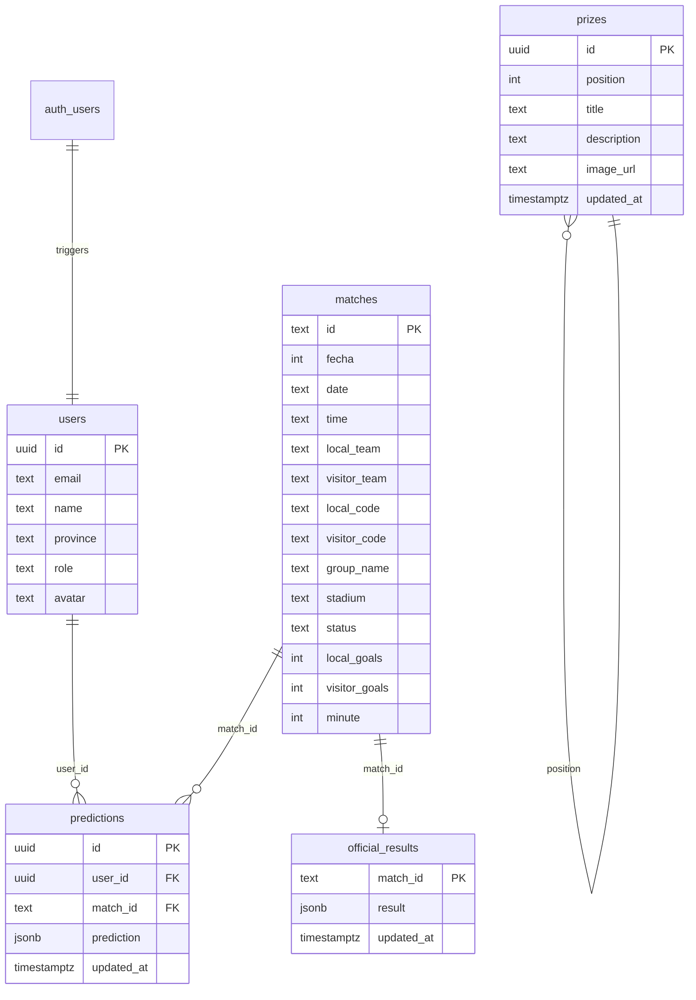

<div align="center">

# ⚽ Prode MagIA

### 🏆 Prode del Mundial FIFA 2026 — por MAG

<br/>

[](https://react.dev/)
[](https://vitejs.dev/)
[](https://supabase.com/)
[](https://www.typescriptlang.org/)
[](https://tailwindcss.com/)
[](https://expressjs.com/)

<br/>

Dashboard interactivo de predicciones de fútbol para el **Mundial FIFA 2026**. Los usuarios registran sus pronósticos bajo un sistema de reglas dinámico, compiten en un ranking general en tiempo real, visualizan estadísticas de rendimiento personalizadas y participan en un chat grupal interactivo.

<br/>

</div>

---

## 📋 Tabla de Contenidos

- [✨ Características](#-características)
- [🏗️ Arquitectura](#️-arquitectura)
- [🛠️ Tech Stack](#️-tech-stack)
- [📁 Estructura del Proyecto](#-estructura-del-proyecto)
- [⚙️ Configuración y Setup](#️-configuración-y-setup)
- [🗄️ Base de Datos](#️-base-de-datos)
- [🔐 Roles y Permisos](#-roles-y-permisos)
- [📊 Sistema de Puntuación](#-sistema-de-puntuación)
- [⏰ Límite de Predicción](#-límite-de-predicción)
- [🎁 Sistema de Premios](#-sistema-de-premios)
- [💬 Chat Grupal](#-chat-grupal)
- [🚀 Deploy](#-deploy)
- [👥 Autores](#-autores)

---

## ✨ Características

| Feature | Descripción |
|---|---|
| 🎯 **Pronósticos (Cutoff)** | Carga de predicciones con límite estricto de **45 minutos** antes de cada partido. Indicadores visuales y animados de estado en tiempo real. |
| 📊 **Podio y Ranking** | Tabla de posiciones dinámica con un Podio de Honor animado en 3D para los 3 primeros puestos. |
| 🏎️ **Carrera de Puntos** | Línea de tiempo interactiva (directo) del Top 5 de participantes con controles de reproducción automática (Play, Pausa, Reiniciar) y slider manual. |
| 📈 **Historial y Analíticas** | Panel premium con gráfico de progreso por ronda (comparativo entre usuario y líder con filtros), racha de aciertos y sesgos de predicción. |
| 🏅 **Logros e Insignias** | Sistema de logros desbloqueables dinámicamente (Gurú de Grupos, Francotirador, Racha Imbatible, Pacto del Empate, Muro de Acero). |
| 🗺️ **Mapa con Exterior** | Distribución geográfica de participantes por provincia argentina, incluyendo contornos simplificados flotantes para **Madrid** y **Venezuela**. |
| 🎁 **Premios** | Panel de premios configurables por administración según la posición final del ranking. |
| 💬 **Chat Grupal** | Chat grupal integrado en tiempo real mediante Supabase Realtime (canal `postgres_changes`). |
| 👤 **Perfiles de Usuario** | Gestión de avatar, selección de provincia ("¿Desde dónde estás jugando?") y estadísticas personales basadas íntegramente en datos reales de la DB. |
| 🔒 **Autenticación** | Autenticación con Supabase Auth (email/password o Google Auth) con flujo inteligente de redirección en desarrollo local. |

---

## 🏗️ Arquitectura

```
┌──────────────────────────────────────────────────────┐
│                     FRONTEND                         │
│         React 19 + Vite + TailwindCSS 4              │
│              Puerto: 3000                            │
│                                                      │
├──────────────┬───────────────────────────────────────┤
│   Supabase   │          API Backend                  │
│   Client JS  │      Express 5 + TypeScript           │
│  (Auth, DB)  │         Puerto: 3005                  │
│              │                                       │
├──────────────┴───────────────────────────────────────┤
│                    SUPABASE                          │
│       Auth  ·  PostgreSQL  ·  RLS  ·  Storage        │
├──────────────────────────────────────────────────────┤
│                 API-FOOTBALL (v3)                    │
│      Sincronización de fixture y partidos en vivo     │
├──────────────────────────────────────────────────────┤
│               SUPABASE REALTIME                      │
│           Chat grupal en tiempo real                 │
└──────────────────────────────────────────────────────┘
```

---

## 🛠️ Tech Stack

### Frontend (`/Front`)
- **React 19**: Interfaz declarativa, Context API para estado de autenticación.
- **Vite 6**: Servidor de desarrollo optimizado y bundles ultrarápidos.
- **TypeScript**: Tipado estático estricto.
- **TailwindCSS 4**: Estilos modernos y customizados mediante variables CSS nativas (diseño premium *glassmorphism*).
- **Lucide React**: Iconografía minimalista.
- **Motion (Framer)**: Micro-animaciones en tarjetas de fixtures y transiciones de tabs.
- **Supabase Client JS**: Comunicación directa para autenticación y base de datos.

### Backend (`/API`)
- **Express 5**: Servidor RESTful para tareas de administración y sincronización.
- **TypeScript**: Consistencia de tipado en toda la solución.
- **API-Football v3**: API externa para la obtención automatizada de resultados y partidos del mundial.
- **Luxon**: Manejo preciso de fechas y husos horarios locales.

### Base de Datos e Infraestructura
- **Supabase**: Base de datos relacional PostgreSQL.
- **Row Level Security (RLS)**: Políticas estrictas a nivel de fila para proteger los pronósticos y configuraciones de usuario.
- **Supabase Realtime**: Manejo de eventos de chat instantáneos.

---

## 📁 Estructura del Proyecto

```
prode-mag-ia/
├── API/                          # Backend Express
│   ├── index.ts                  # Entry point — rutas y sync de partidos
│   ├── package.json
│   ├── tsconfig.json
│   └── .env                      # Variables de entorno del backend
│
├── Front/                        # Frontend React + Vite
│   ├── public/                   # Assets estáticos (premios, etc.)
│   ├── src/
│   │   ├── App.tsx               # Componente raíz con navegación por pestañas (Tabs)
│   │   ├── main.tsx              # Entry point de React
│   │   ├── index.css             # Estilos globales y tokens de diseño Glassmorphism
│   │   ├── types.ts              # Tipos y modelos de datos TS
│   │   ├── data.ts               # Estructuras de soporte y flags
│   │   ├── components/
│   │   │   ├── AuthWall.tsx          # Login, Registro y Google Auth
│   │   │   ├── DashboardView.tsx     # Resumen de inicio
│   │   │   ├── PredictionsList.tsx   # Carga y edición de pronósticos
│   │   │   ├── FixtureBracket.tsx    # Bracket interactivo de eliminatorias
│   │   │   ├── DetailedStandings.tsx # Tabla de posiciones y estadísticas detalladas
│   │   │   ├── StandingsTable.tsx    # Widget simplificado de posiciones
│   │   │   ├── HistoryAndStats.tsx   # Podio, Línea de tiempo de carrera de puntos, Heatmap y Logros
│   │   │   ├── PremiosView.tsx       # Catálogo de premios
│   │   │   ├── UserHeader.tsx        # Encabezado del participante
│   │   │   ├── UserProfilePanel.tsx  # Configuración de perfil y avatar
│   │   │   ├── ChatWidget.tsx        # Widget de chat realtime
│   │   │   ├── ArgentinaMap.tsx      # Mapa de Argentina interactivo con soporte de Madrid/Venezuela
│   │   │   ├── ChallengeBox.tsx      # Widget dinámico de retos
│   │   │   ├── GroupStandingsWidget. # Posiciones en fase de grupos
│   │   │   └── SuperAdminSettings.tsx# Gestión y configuraciones del administrador
│   │   ├── context/
│   │   │   └── AuthContext.tsx       # Contexto global de Supabase Auth
│   │   ├── lib/
│   │   │   └── supabase.ts           # Cliente Supabase con redirección inteligente para dev local
│   │   └── utils/
│   │       ├── points.ts             # Lógica del sistema de puntos 3+1+1
│   │       ├── standings.ts          # Algoritmo de ordenación y desempates de posiciones
│   │       ├── fixtureResolver.ts    # Procesamiento del fixture eliminatorio
│   │       └── stadiumAudio.ts       # Audio interactivo de tribuna
│   ├── sql/
│   │   ├── create_prizes_table.sql
│   │   ├── create_messages_table.sql
│   │   ├── official_results_rls_admin.sql
│   │   └── users_rls_allow_all.sql
│   ├── vite.config.ts
│   └── package.json
│
├── supabase-schema.sql           # Schema principal completo de la DB
├── .env.example                  # Plantilla de variables de entorno consolidada
└── README.md                     # Este archivo
```

---

## ⚙️ Configuración y Setup

### Prerrequisitos

- **Node.js** >= 18
- Cuenta en **Supabase**
- API Key de **API-Football** (opcional, para actualización en vivo)

### 1. Clonar el repositorio

```bash
git clone https://github.com/NicOrtiz29/ProdeMag.git
cd ProdeMag
```

### 2. Configuración de la Base de Datos

1. Ingresa a la consola de Supabase, ve al **SQL Editor** y ejecuta el contenido de [supabase-schema.sql](file:///Users/nico/Documents/prode-mag-ia/supabase-schema.sql) para inicializar las tablas de partidos, predicciones, perfiles y resultados.
2. Ejecuta los scripts SQL adicionales de la carpeta `Front/sql/` en este orden:
   - `users_rls_allow_all.sql`
   - `official_results_rls_admin.sql`
   - `create_messages_table.sql`
   - `create_prizes_table.sql`

### 3. Configurar Variables de Entorno

Duplica el archivo [.env.example](file:///Users/nico/Documents/prode-mag-ia/.env.example) para crear las configuraciones de frontend y backend:

#### Frontend (`Front/.env`)
```env
VITE_SUPABASE_URL=https://tu-proyecto.supabase.co
VITE_SUPABASE_ANON_KEY=tu_anon_key
```

#### Backend (`API/.env` o raíz `/.env`)
```env
SUPABASE_URL=https://tu-proyecto.supabase.co
SUPABASE_SERVICE_ROLE_KEY=tu_service_role_key
API_SPORTS_KEY=tu_api_football_key
LEAGUE_ID=1
SEASON=2026
PORT=3005
```

### 4. Instalar Dependencias

```bash
# Frontend
cd Front
npm install

# Backend
cd ../API
npm install
```

### 5. Iniciar Servidores de Desarrollo

```bash
# Terminal 1 — Frontend (Puerto 3000)
cd Front
npm run dev

# Terminal 2 — Backend (Puerto 3005)
cd API
npm start
```

---

## 🗄️ Base de Datos

### Diagrama Entidad-Relación



---

## 🔐 Roles y Permisos

| Rol | Permisos |
|---|---|
| **User** | Cargar sus propios pronósticos, interactuar con el chat, ver ranking, mapa y premios. |
| **Admin** | Todo lo de User + cargar resultados oficiales en partidos. |
| **Superadmin** | Acceso total al panel de control, gestión avanzada de premios y partidos del fixture. |

La seguridad de las consultas directas desde el cliente se gestiona mediante políticas **RLS (Row Level Security)** en Supabase.

---

## 📊 Sistema de Puntuación (Regla 3+1+1)

El puntaje acumulado por cada predicción sobre un partido jugado se calcula siguiendo una estructura de **3+1+1**:

| Logro en el Pronóstico | Puntos | Descripción |
|---|:---:|---|
| **Tendencia Correcta** | **3** | Acertar el ganador del partido o el empate. |
| **Goles Local Exactos** | **+1** | Acertar el número exacto de goles del equipo local. |
| **Goles Visitante Exactos**| **+1** | Acertar el número exacto de goles del equipo visitante. |

- **Puntaje Máximo por partido**: **5 puntos** (Resultado Exacto).
- **Acierto Parcial**: Si fallas la tendencia pero aciertas la cantidad de goles de uno de los equipos (por ejemplo, predijiste 2-1, pero terminó 1-1), obtienes **1 punto** por la cantidad exacta de goles.

---

## ⏰ Límite de Predicción

- Para garantizar la transparencia y equidad de la competencia, la edición de pronósticos para cada partido se bloquea estrictamente **45 minutos antes** del horario oficial de inicio del partido.
- Las tarjetas de partido muestran estados de tiempo animados y bloquean automáticamente los campos de entrada de goles al cumplirse el límite de tiempo.

---

## 🎁 Sistema de Premios

Los premios se configuran de forma dinámica por los administradores desde la base de datos y se muestran en la sección correspondiente. Ejemplos por defecto:

- **1° Puesto**: Camiseta oficial de la Selección Argentina 🇦🇷
- **2° Puesto**: Cafetera Nespresso ☕
- **3° Puesto**: Pava eléctrica premium ⚡
- **4° Puesto**: Juego de mate artesanal 🧉
- **5° Puesto**: Kit de Gin Tonic premium 🍸

---

## 💬 Chat Grupal

- **Realtime**: El widget del chat grupal utiliza Supabase Realtime para transmitir mensajes de manera instantánea a todos los participantes en línea.
- **Persistencia**: Los mensajes se guardan en la tabla `messages` con referencias al avatar y nombre de cada participante.
- **Diseño**: Visualización diferenciada con burbujas de colores (verde para mensajes propios y blanco/gris para los de otros participantes).

---

## 🚀 Deploy

### Frontend
Para compilar la aplicación React optimizada para producción:
```bash
cd Front
npm run build
```
El directorio de salida será `/Front/dist`, listo para alojarse en plataformas estáticas como **Netlify**, **Vercel** o **Cloudflare Pages**.

### Backend
El servidor Express se puede desplegar como servicio web en plataformas como **Railway**, **Render** o **Fly.io**. Para sincronizar manualmente fixtures a través de endpoints protegidos por token:

```bash
curl -X POST https://mi-backend.railway.app/api/sync-matches \
  -H "Authorization: Bearer TU_SERVICE_ROLE_KEY" \
  -H "Content-Type: application/json"
```

---

## 👥 Autores

<div align="center">

Creado con 💜 por **MAG**

**Prode MagIA** © 2026 — Copa Mundial de la FIFA 2026

</div>
